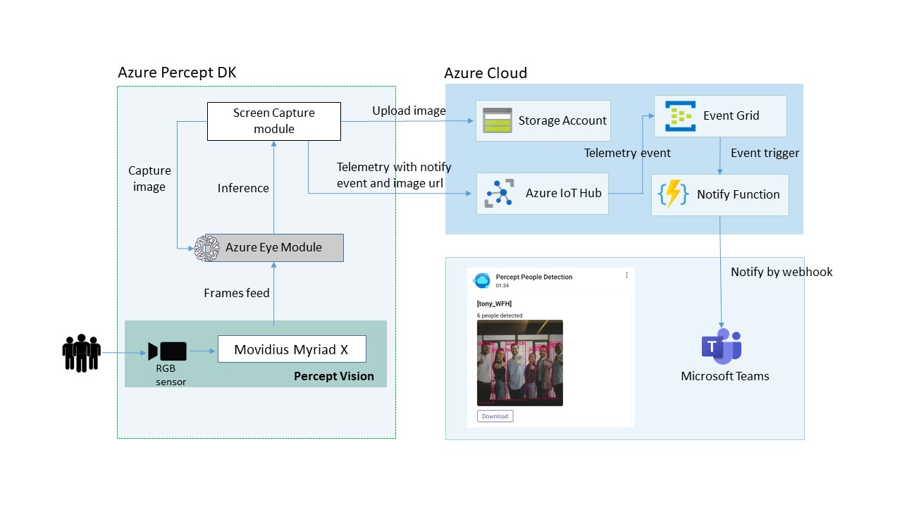
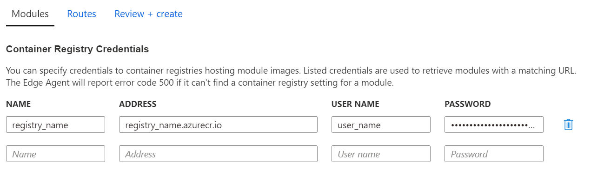
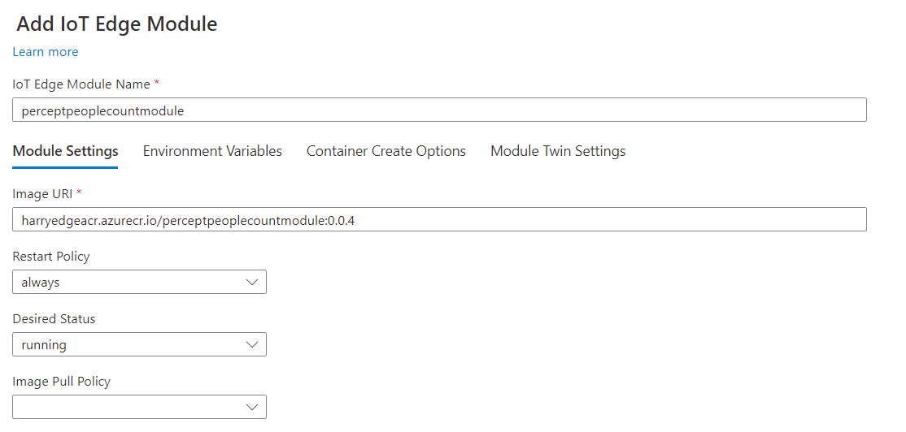
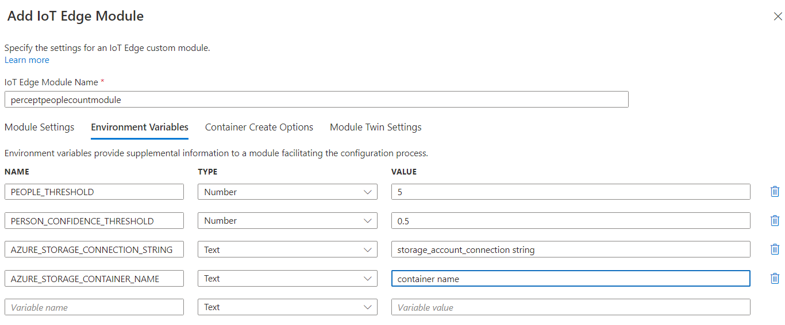
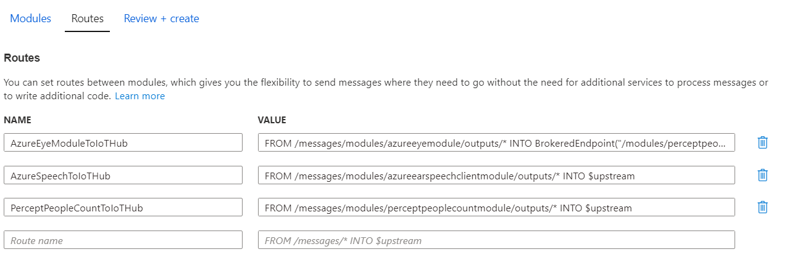
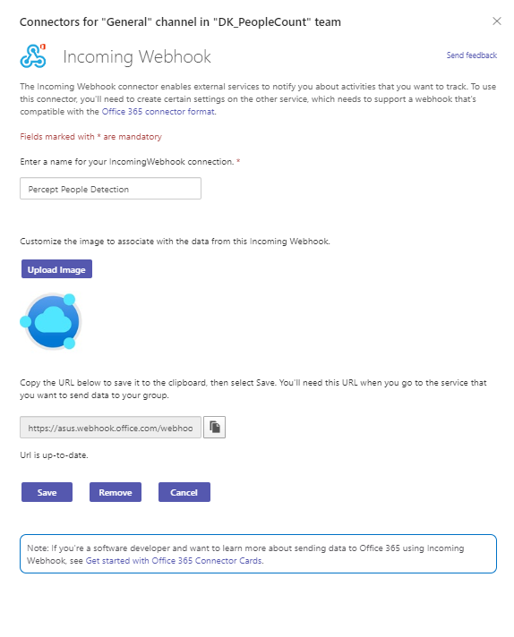
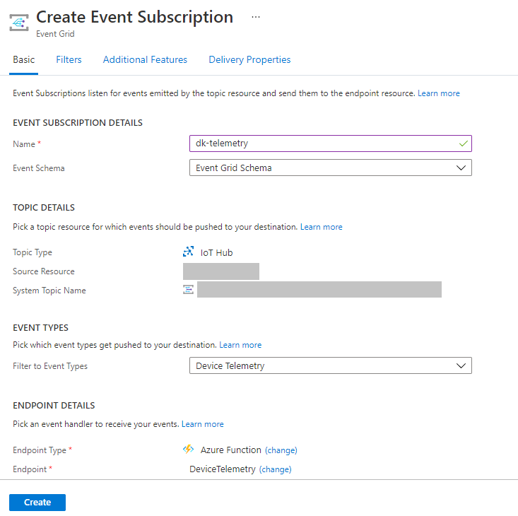

# Azure Percept DK with People counting to Microsoft Teams notification


## Overview

This repository documentation for the people counting detection application with pre-loaded Azure Percept DK object detection model.
In this repository, you will find:

* [people_count_module](percept_people_count_module): The code for the perceptpeoplecountmodule, which is the custom IoT edge module responsible for:
  * Handle the AI recognition result from azureeyemodule
  * Get the screenshot of RTSP and upload to Azure storage account
  * Send the number of people count and screenshot url to IoT Hub
* [notify_function](notify_function): The code for an Azure function App, which is response for receiving event from IoT Hub and triggering notify to Microsoft Teams by incoming webhooks


## Azure Percept DK

Azure Percept DK is an ASUS x Microsoft Azure Perception edge AI development kit designed for developing vision and audio AI applications with [Azure Percept Studio](https://docs.microsoft.com/en-us/azure/azure-percept/overview-azure-percept-studio). Azure Percept DK integrated hardware accelerator with Azure AI and Azure IoT services and designed them to be simple to use and ready to go with minimal setup:
  * Out-Of-Box experience(OOBE) brings your Azure Percept DK to Azure Portal in minutes
  * AI model lifecycle management software enables you to build and deploy complete computer vision applications, from simple no-code models to more advanced applications
  * Hardware base sensor access control, secure sensing data and the AI model


After completing OOBE, there are some modules already running at Azure Percept DK, one of them is Azure eye module, response for receiving camera frames, inferring objects with Azure custom vision and send results to IoT Hub

## Workflow

This repository can be used to bring your own custom module, this repository using people counting as an example, to Azure Percept DK to use inferring objects to build own application. Below shows the architecture of people counting detection application with Azure Percept DK:



The flow for doing that would be this:
1. Build people counting module, reference from [people_count_module](percept_people_count_module)
2. Push image to docker registry, like [Azure container registry](https://docs.microsoft.com/en-us/azure/container-registry/) and so on
3. Deploy people counting module to Azure Percept DK at IoT Hub
   1. Config docker registry information if using private registry
    
   2. Set image source
    
   3. Add some image environment variables
    * PEOPLE_THRESHOLD: The number of people detected threshold value
    * PERSON_CONFIDENCE_THRESHOLD: The confidence threshold value
    * AZURE_STORAGE_CONNECTION_STRING: Azure storage account connection string, used to connect service
    * AZURE_STORAGE_CONTAINER_NAME: The container name used to save image files
    
    4. Change routing settings (can reference from [declare routes](https://docs.microsoft.com/en-us/azure/iot-edge/module-composition?view=iotedge-2020-11#declare-routes))
    * Modify the value of AzureEyeModuleToIoTHub, let the telemetry send to people count module
    ```
    FROM /messages/modules/azureeyemodule/outputs/* INTO BrokeredEndpoint("/modules/perceptpeoplecountmodule/inputs/input1")
    ```
    * Add PerceptPeopleCountToIoTHub, send telemetry to IoT Hub
    ```
    FROM /messages/modules/perceptpeoplecountmodule/outputs/* INTO $upstream
    ```
    
  4. Set Teams incoming webhooks and get webhooks url, can reference from [Post external requests to Teams with incoming webhooks](https://docs.microsoft.com/en-us/microsoftteams/platform/webhooks-and-connectors/how-to/add-incoming-webhook)
  5. Start notify Azure function app from [notify_function](notify_function), and set TEAMS_WEBHOOK_URL environment value form previous step
    
  6. Add IoT Hub event subscription
    

